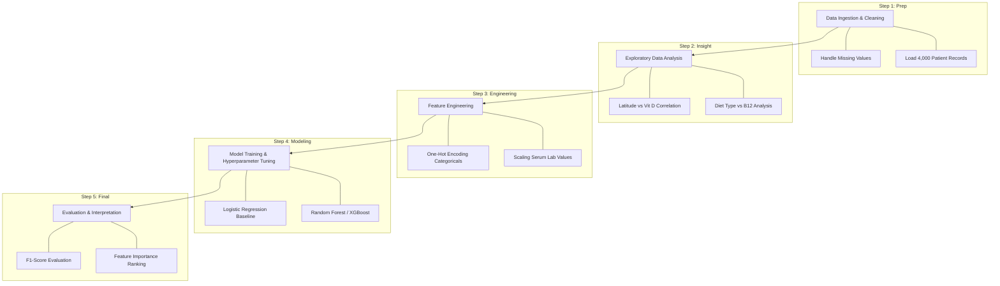

# Machine Learning-Based Differential Diagnosis of Vitamin Deficiencies

**Prepared for** UMBC Data Science Master Degree Capstone  
**Instructor:** Dr. Chaojie (Jay) Wang  
**Author:** Varun Lautkar  
**GitHub:** [VarunLautkar/UMBC-DATA606-Capstone](https://github.com/VarunLautkar/UMBC-DATA606-Capstone)  
**LinkedIn:** [varunlautkar](https://www.linkedin.com/in/varunlautkar/)

---

## Table of Contents
1. [Introduction](#introduction)
2. [Proposed Workflow](#proposed-workflow)
3. [Data Description](#data-description)
4. [Target](#target)
5. [Evaluation and Results](#evaluation-and-results)
6. [References](#references)

---

## Introduction

### What is Nutritional Deficiency Screening?
Nutritional deficiency screening is the process of using predictive analytics to identify individuals at risk of insufficient micronutrient levels. Unlike traditional clinical diagnosis which relies on invasive blood tests, data-driven screening utilizes "biological signatures"—the intersection of lifestyle habits, demographic factors, and physical symptoms—to predict health outcomes.

### Why do we Predict Nutritional Risks?
Identifying health risks early allows for preventative intervention through diet or supplementation before clinical conditions become chronic.
* **Preventative Healthcare:** Early detection of deficiencies prevents long-term neurological or skeletal damage.
* **Cost Reduction:** Automated screening helps healthcare systems prioritize patients for clinical testing, reducing unnecessary expenditures.
* **Personalized Wellness:** Provides actionable insights into how specific variables (e.g., Veganism or living in High Latitudes) affect individual blood chemistry.

## Proposed Workflow

The project follows a structured Data Science Life Cycle (DSLC) to ensure the model is robust and the results are reproducible.

## Data Description

**Link to dataset:** [Vitamin Deficiency Disease Prediction Dataset (2026)](../data/vitamin_deficiency_disease_dataset_20260123.csv)

The data at hand consists of comprehensive patient records documenting the interplay between lifestyle habits and clinical nutritional health. The dataset contains **4,000 rows** and **34 columns**, providing a rich set of features for predictive modeling.

### **Dataset Feature Catalog**

The dataset consists of **4,000 patient records** and **34 total columns**. Below are the key predictive features and the target variable used in the Risk Engine.

| Feature Name | Data Type | Category | Description / Clinical Significance |
| :--- | :--- | :--- | :--- |
| **age** | int64 | Demographic | Patient age; used for age-related malabsorption risks. |
| **gender** | object | Demographic | Biological sex (Male/Female/Non-binary). |
| **diet_type** | object | Lifestyle | Primary predictor for B12 and Iron deficiencies (e.g., Vegan). |
| **sun_exposure** | object | Lifestyle | Categorical measure (Low/Med/High) of UV contact. |
| **latitude_region** | object | Geographic | Proxy for natural Vitamin D synthesis capability. |
| **has_fatigue** | int64 (Binary) | Symptom | Binary indicator (0/1) for persistent exhaustion. |
| **has_bone_pain** | int64 (Binary) | Symptom | Binary indicator (0/1) for skeletal discomfort. |
| **serum_vitamin_d_ng_ml** | float64 | Lab Value | Clinical blood level of Vitamin D. |
| **serum_vitamin_b12_pg_ml** | float64 | Lab Value | Clinical blood level of Vitamin B12. |
| **vitamin_b12_percent_rda**| float64 | Dietary | Percentage of daily requirement met through intake. |
| **disease_diagnosis** | **Target** | **Label** | The final clinical classification (Multiclass). |

---

## Target

The target variable for this project is **`disease_diagnosis`**.
## Predictive Variables
As previously mentioned, the goal of this "Risk Engine" is to provide a differential diagnosis based on input features. This is a **Multiclass Classification** problem. The model will predict one of the following states:
1. **Healthy:** No significant deficiency.
2. **Anemia:** Identified by low iron or B12 levels.
3. **Scurvy:** Identified by severe Vitamin C deficiency markers.
4. **Rickets_Osteomalacia:** Identified by severe Vitamin D deficiency.
5. **Night_Blindness:** Identified by severe Vitamin A deficiency markers.

Forecasting this target allows for early clinical intervention and a personalized understanding of nutritional risk based on a patient's unique lifestyle profile.

---

## Evaluation And Results

All three models will be evaluated and fine-tuned for clinical reliability. The primary evaluation metrics will include:
* **F1-Score:** To ensure balanced performance across all five deficiency classes.
* **Recall (Sensitivity):** High recall is essential in healthcare to minimize "False Negatives"—ensuring that no truly deficient patient is missed by the model.
* **Confusion Matrix:** To visualize which diseases share similar data signatures and are most commonly misclassified.

The final outcome will be an analytical framework that ranks "Feature Importance," revealing which lifestyle factor is the strongest predictor for each deficiency type.

---

## **Model Deployment Workflow**

To transition the predictive "Risk Engine" from an offline development environment to a live, interactive web application, the following deployment pipeline will be executed:

### **1. Model Serialization**
* **Exporting Weights:** After finalizing hyperparameter tuning for the **Random Forest** or **XGBoost** model, the trained object will be exported.
* **Format:** The model will be saved using `.joblib` or `.pkl` (Pickle) formats to preserve the learned weights and decision logic for real-time inference.

### **2. Application Scripting (`app.py`)**
* **Framework:** A user interface will be developed using the **Streamlit** framework in Python.
* **UI Components:** The script will define input widgets for the predictive features, such as numeric sliders for `age`, dropdown menus for `diet_type`, and toggle switches for binary symptoms (0s and 1s) like `has_fatigue`.

### **3. Local Validation and Testing**
* **Execution:** The application will be tested locally using the command `streamlit run app.py`.
* **Data Mapping:** Testing will focus on ensuring that user-facing inputs are correctly mapped back to the **binary code (0/1)** and scaled numerical values expected by the model.

  ---
## References

* [1] National Institutes of Health (NIH). [Vitamin B12 Fact Sheet for Health Professionals](https://ods.od.nih.gov/factsheets/VitaminB12-HealthProfessional/).
* [2] Waihenya, et al. [Machine Learning in Nutritional Epidemiology](https://pubmed.ncbi.nlm.nih.gov/31336057/). *Journal of Nutrition.*
* [3] World Health Organization (WHO). [Global prevalence of vitamin A deficiency in populations at risk](https://www.who.int/publications/i/item/9789241598019).
* [4] Kaggle. [Vitamin Deficiency Prediction Dataset](https://www.kaggle.com/datasets/vinesmsuic/vitamin-deficiency-prediction-dataset).
